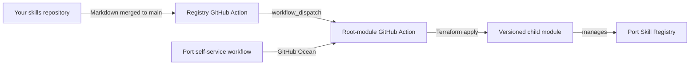

# Port Skills Registry Sync

This root module composes the versioned
[`terraform-port-skills-registry`](https://github.com/sce81/terraform-port-skills-registry)
child module. The child synchronizes Markdown files from the skills repository you
configure to entities in Port's `skill` blueprint. Terraform runs only in GitHub
Actions; development teams do not run it from their machines.

## Who should use this

| Audience | Start here |
| --- | --- |
| Development teams | Add or update Markdown guidance in any folder of their configured skills repository. |
| Platform owners | Configure GitHub Environment credentials and maintain Terraform state access. |
| Port users | Start **Sync Port Skills Registry** in Port for an on-demand synchronization. |

## How synchronization works



There are two safe ways to synchronize:

1. Merge a Markdown change into your configured skills repository's `main` branch.
   Its automation can dispatch the root-module sync automatically.
2. Run **Sync Port Skills Registry** from Port. It has no form fields and always uses
   the `Development` GitHub Environment.

Each sync discovers Markdown files recursively across the configured repository.
Terraform creates or updates one `skill` entity per file, deletes a managed entity
when its source file is removed, and prefixes its Port title with the source folder.

## Configure your skills repository

The skills repository is not fixed to `sce81/Port-Skills-Registry`. Set these required
root-module variables to the repository your team owns:

- `skills_registry_owner` — its GitHub organization or username, such as `acme-platform`.
- `skills_registry_repository` — its repository name, such as `engineering-skills`.

The following variables have defaults but can be changed when your repository differs:

- `skills_registry_branch` — source branch; defaults to `main`.
- `skills_registry_path` — optionally limits recursive discovery to one directory;
  defaults to empty and discovers Markdown files anywhere in the repository.
- `skills_registry_token` — empty for a public repository; for a private repository,
  supply a fine-grained token with read-only Contents access to that repository.
- `default_skill_location` — `global` or `project`; defaults to `global`.

For GitHub Actions runs, configure the `Development` environment variables
`SKILLS_REGISTRY_OWNER`, `SKILLS_REGISTRY_REPOSITORY`, `SKILLS_REGISTRY_BRANCH`, and
`SKILLS_REGISTRY_PATH`. Configure `PORT_SKILLS_REGISTRY_TOKEN` as a secret only when
the selected skills repository is private.

## Write a skill

Create a Markdown file in any folder. File names become lowercase Port identifiers
while preserving underscores; the Port title and `Source Folder` property identify the
folder that contains it:

```text
platform-guidance/Terraform_Standards.md → terraform_standards, titled "[platform-guidance] Terraform Standards"
```

Use a clear H1 title and keep the document focused on one team task. The H1 becomes
the Port title and description when front matter is not present.

```markdown
# Terraform Standards

Use `terraform fmt` before committing configuration changes.
```

Optional YAML front matter gives explicit metadata:

```markdown
---
name: terraform_standards
title: Terraform Standards
description: Shared conventions for Terraform development.
location: global
---

# Terraform Standards

Use `terraform fmt` before committing configuration changes.
```

`location` is optional and defaults to `global`.

## Team documentation standard

Treat each Markdown file as a maintained engineering contract:

- Write for the team that will act on the guidance. State the outcome first, then
  prerequisites, ordered steps, and expected result.
- Use descriptive H1/H2 headings, short paragraphs, and code blocks for commands or
  configuration. Add a diagram only when it clarifies a non-obvious flow.
- Explain the reason behind rules, not only the rule itself. Link to the canonical
  source instead of duplicating large references.
- Include a **Troubleshooting** section for common failures, their likely cause, and
  the next action. Update it when support patterns emerge.
- Review the file with the code or process it documents. Remove or correct outdated
  guidance in the same pull request.

Recommended template:

```markdown
# <Task or standard>

<One-sentence outcome and intended audience.>

## When to use this

## Prerequisites

## Steps

## Expected result

## Troubleshooting

## Related documentation
```

## Platform setup

The root module's `Development` GitHub Environment requires these secrets:

- `PORT_CLIENT_ID`
- `PORT_CLIENT_SECRET`
- `PORT_SKILLS_REGISTRY_TOKEN` — fine-grained, read-only **Contents** access to the
  configured skills repository; it is not needed for a public repository
- `AWS_ACCESS_KEY_ID`
- `AWS_SECRET_ACCESS_KEY`

It also requires:

- `TF_STATE_BUCKET`
- `TF_STATE_KEY`
- `TF_STATE_REGION`

The GitHub workflow imports an existing `skill` blueprint into the configured remote
state when needed, initializes the pinned `v1.0.4` child module, validates Terraform,
then applies the synchronization.

The extraction migration has moved the existing Port blueprint, skill entities, and
sync workflow to the child-module addresses without recreation.

For automatic syncs, your skills repository needs the repository secret
`PORT_SKILLS_SYNC_DISPATCH_TOKEN`. It needs **Actions: Read and write** access to the
repository hosting this root module; the source repository's default
`GITHUB_TOKEN` cannot dispatch workflows in another repository.

## Troubleshooting the sync

| Symptom | Likely cause | Next action |
| --- | --- | --- |
| Registry merge does not start a sync | Dispatch token is missing or lacks Actions write access. | Check `PORT_SKILLS_SYNC_DISPATCH_TOKEN` in `Port-Skills-Registry`. |
| Sync fails during `terraform init` | The AWS identity cannot read the configured S3 state object. | Grant state and lock-file access for `TF_STATE_KEY`. |
| A skill is not created | The file is not Markdown or is outside the optional configured path. | Use a `.md` extension, or clear `SKILLS_REGISTRY_PATH` to search all folders. |
| Port rejects an entity | Required metadata does not match the `skill` blueprint. | Use front matter and confirm required fields. |

## Ownership and review

Development teams own the correctness of their guidance. Platform owners own the
sync workflow, GitHub Environment, Terraform state, and child-module releases. The
child module owns every Port resource; the root module only wires its released version
and inputs. Review this README whenever the registry layout, credential contract, or
deployment workflow changes.
